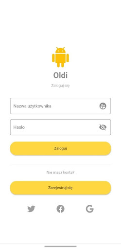
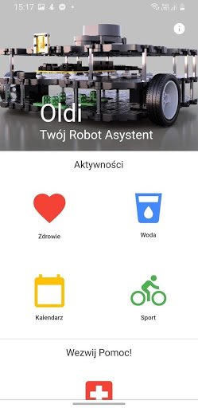
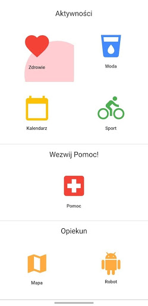
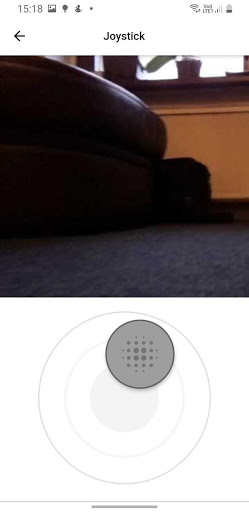
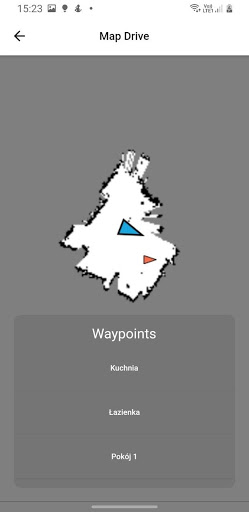

# Chack out refreshed version:

Please note this app was made by beginners, there are some bad practices like not disposing some objects, architecture and project structure is also not great but it makes a really easy example to follow. If you're interested only in navigation check out this repo (no web-views used):
https://github.com/Rongix/ros_navigation_command_app

# ROS Teleop Application

This is a Flutter multiplatform (Android & iOS) project for interacting with ROS Robots based on ROS Melodic/Kinetic. Main function of the app is teleoperation of robots using virtual controller and camera view from the web server. 
For interfacing with ROS we use https://github.com/Sashiri/ros_nodes please check it out. 

Project is presented as interactive interface for mobile robot that can be used for medical purposes and can be controlled remotely by virtual controller or point-click navigation on the map. 

    


## Getting Started

A few resources to get you started if this is your first Flutter project:

- [Lab: Write your first Flutter app](https://flutter.dev/docs/get-started/codelab)
- [Cookbook: Useful Flutter samples](https://flutter.dev/docs/cookbook)

For help getting started with Flutter, view our
[online documentation](https://flutter.dev/docs), which offers tutorials,
samples, guidance on mobile development, and a full API reference.

## Prerequisites

- You don't need real robot to run app and navigate.
- [ROS Melodic](http://wiki.ros.org/melodic) - Ubuntu 18.04 / [ROS Kinetic](http://wiki.ros.org/kinetic) - Ubuntu 16.04)
- [Flutter](https://flutter.dev/docs/get-started/install).
- [Node.js](https://nodejs.org/en/) for interactive map. 

## Installation
### Installation of ROS

ROS kinetic: [please follow instruction](http://emanual.robotis.com/docs/en/platform/turtlebot3/pc_setup/)
ROS Melodic: Instruction for Ubuntu 18.04 below:

1. Following step will update your system and install ROS-Melodic-dekstop-full version. It will also create few aliases and source ROS-melodic environment in your .bashrc, and create catkin_ws folder in your root directory.
```
sudo apt update
sudo apt upgrade -y
wget https://raw.githubusercontent.com/ROBOTIS-GIT/robotis_tools/master/install_ros_melodic.sh && chmod 755 ./install_ros_melodic.sh && bash ./install_ros_melodic.sh
```
2. Install dependencies.
```
sudo apt install ros-melodic-joy ros-melodic-teleop-twist-joy ros-melodic-teleop-twist-keyboard ros-melodic-laser-proc ros-melodic-rgbd-launch ros-melodic-depthimage-to-laserscan ros-melodic-rosserial-arduino ros-melodic-rosserial-python ros-melodic-rosserial-server ros-melodic-rosserial-client ros-melodic-rosserial-msgs ros-melodic-amcl ros-melodic-map-server ros-melodic-move-base ros-melodic-urdf ros-melodic-xacro ros-melodic-compressed-image-transport ros-melodic-rqt-image-view ros-melodic-gmapping ros-melodic-navigation ros-melodic-interactive-markers
```
3. Install packages for Turtlebot3 (it contains node for simulation).
```
cd ~/catkin_ws/src/
git clone https://github.com/ROBOTIS-GIT/turtlebot3_msgs.git
git clone https://github.com/ROBOTIS-GIT/turtlebot3.git
git clone https://github.com/ROBOTIS-GIT/turtlebot3_simulations.git
cd ~/catkin_ws && catkin_make
```
4. In the next steps you should configure your network.
```
sudo nano ~/.bashrc
// EDIT FIELDS: Replace with your ip adress. Please not that you should not use http://localhost:11311 because it won't work.
// Get your ip with: hostname -I
// EXAMPLE: export ROS_MASTER_URI=http://192.221.1.11:11311
// EXAMPLE: export ROS_HOSTNAME=192.221.1.11
// REPLACE: 192.221.1.11 with your ip.
```
5. Install camera package.
```
cd ~/catkin_ws/src/
git clone https://github.com/OTL/cv_camera.git
cd ~/catkin_ws && catkin_make

// EXAMPLE of use: rosparam set cv_camera/device_id 001
// EXAMPLE of use: rosrun cv_camera cv_camera_node
```
6. Install rosbridge-server
```
sudo apt install ros-melodic-rosbridge-server
```
7. Install [ros-web-video-server](http://wiki.ros.org/web_video_server).
```
sudo apt install ros-melodic-web-video-server
```
7. Export ROS parameters; simulated robot model. I use waffle_pi. Add appropriete line to your bashrc.
```
export TURTLEBOT3_MODEL=waffle_pi
```

### Installation of Node.js
You can install it with snap or grab installer from [official site](https://nodejs.org/en/).
```
sudo snap install node --classic
```
Install node [http-server](https://www.npmjs.com/package/http-server).
```
npm install http-server
```
Grab [RosHTTPNavigationMap](https://github.com/Rongix/RosHTTPNavigationMap) and run the server. You will be able to see robot position on the map and move it by placing markers.
```
git clone https://github.com/Rongix/RosHTTPNavigationMap.git
```
## Running ROS with application.
Refer [ROBOTIS e-Manual for more information.](http://emanual.robotis.com/docs/en/platform/turtlebot3/overview/#overview)

### Launch ROS
Read instruction how to use launch nodes and fake node in [simulation chapter](http://emanual.robotis.com/docs/en/platform/turtlebot3/simulation/#simulation).
```
roscore
roslaunch turtlebot3_fake turtlebot3_fake.launch
roslaunch turtlebot3_gazebo turtlebot3_house.launch
roslaunch turtlebot3_slam turtlebot3_slam.launch slam_methods:=gmapping
roslaunch turtlebot3_navigation turtlebot3_navigation.launch 
//NOTE: This is example, adjust paths to launch files.
roslaunch '/home/rongix/catkin_ws/src/turtlebot3/turtlebot3_navigation/launch/move_base.launch'
```

### Launch web components
```
//NOTE: rosbridge_websocket starts on port 9090
roslaunch rosbridge_server rosbridge_websocket.launch

//NOTE: web_video_server starts on port 8080
rosrun web_video_server web_video_server

//NOTE: default port of http-server is 8080, I recommend starting it on something else\
~/RosHTTPNavigationMap$ http-server -p 1234
```

## License
This project is licensed under [Apache License 2.0](https://github.com/Rongix/RosRemoteController/blob/master/LICENSE).


